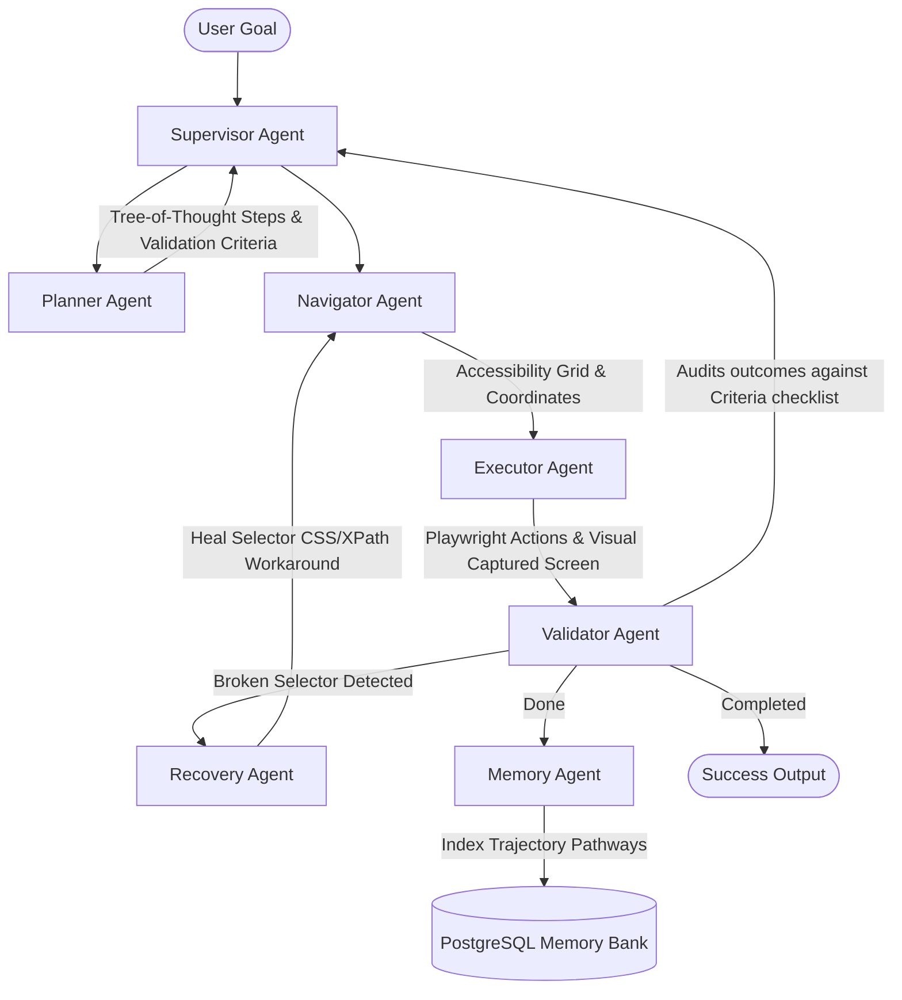

# 🌌 AgentOS: Autonomous AI Web Operations Platform

<p align="center">
  
  
  
  
</p>

---

## 🌟 Vision & Tagline

> **"An autonomous multi-agent system capable of understanding, planning, executing, monitoring, and optimizing complex browser workflows without human intervention."**

AgentOS is a production-grade, enterprise-scale autonomous web operations operating system designed to execute complex, multi-tab internet workflows natively. Powered by a specialized **7-Agent LangGraph Orchestrator**, AgentOS decomposes natural language goals, analyzes visible layouts via visual DOM coordinate grids, safely injects credentials from an AES-256 Vault, executes mouse/keyboard gestures via Playwright, and self-heals broken selectors automatically.

---

## 🛠️ Multi-Agent Architecture & Sequence Flow

AgentOS decomposes browser automation into seven highly specialized, isolated agents communicating asynchronously over a shared **LangGraph State Chart**:



### 🧠 Operational Core Agents
1.  **Planner Agent** ([planner.py](file:///Users/abhishekraj/Desktop/project%20resume/backend/app/agents/planner.py)): Conducts zero-shot **Tree-of-Thought** goal decomposition. Translates a single instruction (e.g. *"Apply to software jobs on LinkedIn"*) into granular action JSON blocks accompanied by specific success checks.
2.  **Navigator Agent** ([navigator.py](file:///Users/abhishekraj/Desktop/project%20resume/backend/app/agents/navigator.py)): Conducts page structural scans. Evaluates elements and coordinate systems to pinpoint interactable buttons, input boxes, or scroll regions.
3.  **Executor Agent** ([executor.py](file:///Users/abhishekraj/Desktop/project%20resume/backend/app/agents/executor.py)): Drives the sandboxed browser context (Playwright). Executes click, scroll, fill, file uploads, and tabs management. Includes a custom visual image synthesis engine for simulated runs.
4.  **Validator Agent** ([validator.py](file:///Users/abhishekraj/Desktop/project%20resume/backend/app/agents/validator.py)): The gatekeeper. Evaluates steps against criteria, verifying DOM changes and scraped fields before advancing step pointer.
5.  **Recovery Agent** ([recovery.py](file:///Users/abhishekraj/Desktop/project%20resume/backend/app/agents/recovery.py)): Implements selector self-healing. Automatically diagnoses timeouts, locates alternative CSS/XPath targets, and heals the graph state on-the-fly without manual intervention.
6.  **Memory Agent** ([memory.py](file:///Users/abhishekraj/Desktop/project%20resume/backend/app/agents/memory.py)): Parses completed action trails, indexes layouts, and stores successful selectors in PostgreSQL for immediate retrieval on future visits.
7.  **Supervisor Agent** ([supervisor.py](file:///Users/abhishekraj/Desktop/project%20resume/backend/app/agents/supervisor.py)): The coordinator. Measures API token consumption, oversees safety gates, manages multi-tab threads, and triggers Human-in-the-Loop approval requests.

---

## 💎 World-Class Showcase Features

> [!IMPORTANT]
> ### 1. Dual-Mode Execution Engine
> *   **Live Production Mode**: Boots sandboxed Playwright engines, taking screenshots, analyzing HTML DOM grids, and communicating directly with OpenAI Vision (GPT-4o) or NVIDIA NIM APIs.
> *   **Simulation Mode (Default/Demo)**: An ultra-realistic demo sandbox synthesizing dynamic webpage mockups, custom mouse pointer grids, and step events. Ideal for recruiter reviews without needing live keys.

> [!TIP]
> ### 2. Self-Healing Selector Engine
> When a selector shifts (e.g. A/B testing variations or layout updates), the **Recovery Agent** recalculates accessibility pathways and applies fuzzy-matching CSS selector overrides in memory without aborting the thread:
> ```
> [Selector Fail] button.jobs-search-box__submit-button -> TIMEOUT
> [Recovery Node] Searching accessibility tree heuristics...
> [Heal Applied] Replaced with: button:has-text('Submit'), input[type='button']
> [State Update] Rescheduling thread... Success!
> ```

> [!CAUTION]
> ### 3. Cryptographic Secure Vault
> Encrypts credentials symmetrically using **AES-256 (Fernet)** with derived SHA-256 secrets. Credentials are decrypted strictly in-memory during execution frames and never written to logs or databases in plain-text, ensuring absolute multi-tenant account isolation.

---

## 🔍 Recruiter Technical Evaluation Map

If you are a hiring manager or tech lead auditing this project, here is a checklist of files to inspect to judge coding caliber, concurrency models, and software engineering practices:

*   **State Chart Logic**: Inspect [supervisor.py](file:///Users/abhishekraj/Desktop/project%20resume/backend/app/agents/supervisor.py) to audit the **LangGraph StateGraph** compilation, routing functions, and conditional validation loops.
*   **Cryptographic Vaulting**: Inspect [security.py](file:///Users/abhishekraj/Desktop/project%20resume/backend/app/core/security.py) and [main.py](file:///Users/abhishekraj/Desktop/project%20resume/backend/app/main.py) to review how AES-256 symmetric vaults are implemented.
*   **Dynamic UI Canvas Drawing**: Inspect [executor.py](file:///Users/abhishekraj/Desktop/project%20resume/backend/app/agents/executor.py) lines 136–256 to view the Pillow (PIL) canvas drawing mechanics that synthesize visual browser mockups for the Replay Center.
*   **Real-Time Streaming**: Inspect [main.py](file:///Users/abhishekraj/Desktop/project%20resume/backend/app/main.py) lines 190–280 to audit the high-frequency **FastAPI WebSockets Connection Manager** which streams LangGraph state transitions `.astream()` node-by-node.

---

## 📂 Project Directory Structure

```
agentos/
├── backend/
│   ├── app/
│   │   ├── api/             # REST Endpoints (Workflows, Sessions, Memories, Secure Vault)
│   │   ├── agents/          # LangGraph Multi-Agent configurations
│   │   │   ├── graph.py     # Main Compiled LangGraph definition
│   │   │   ├── state.py     # Central shared Agent State Schema
│   │   │   ├── planner.py   # Planner node
│   │   │   ├── navigator.py # Navigator node
│   │   │   ├── executor.py  # Playwright & PIL simulator
│   │   │   ├── validator.py # Validator node
│   │   │   ├── memory.py    # Database indexing memory
│   │   │   ├── recovery.py  # Heuristic self-healer node
│   │   │   └── supervisor.py# Routing supervisor node
│   │   ├── core/            # App Settings (Pydantic) & AES Vault isolation
│   │   ├── db/              # SQLAlchemy database session handles
│   │   └── main.py          # FastAPI application server entrypoint
│   ├── Dockerfile
│   └── requirements.txt
├── frontend/
│   ├── src/
│   │   ├── app/             # Next.js App Router (Layouts, Globals CSS, SPA Dashboard)
│   │   └── tailwind.config.js# Sleek glassmorphism theme configurations
│   ├── package.json
│   └── Dockerfile
└── docker-compose.yml       # Standard container cluster orchestrator
```

---

## ⚡ Setup & Run Instructions

### Option A: Run via Docker Compose (Recommended)
This launches PostgreSQL, Redis, Uvicorn (FastAPI), and Next.js as unified microservices out-of-the-box:

1. Navigate to the folder:
   ```bash
   cd "/Users/abhishekraj/Desktop/project resume"
   ```
2. Build and launch the container cluster:
   ```bash
   docker-compose up --build
   ```
3. Open your browser:
   *   **Frontend Dashboard**: [http://localhost:3001](http://localhost:3001)
   *   **FastAPI API Docs**: [http://localhost:8000/docs](http://localhost:8000/docs)

---

### Option B: Local Setup (Native Execution)

If you prefer to run the services natively in your local macOS terminal:

#### 1. Start Backend (FastAPI + LangGraph)
1. Navigate to backend:
   ```bash
   cd backend
   ```
2. Create and activate a Python virtual environment:
   ```bash
   python3 -m venv venv
   source venv/bin/activate
   ```
3. Install Python packages and Playwright browser:
   ```bash
   pip install -r requirements.txt
   playwright install chromium
   ```
4. Start Uvicorn:
   ```bash
   uvicorn app.main:app --reload --port 8000
   ```

#### 2. Start Frontend (Next.js TypeScript)
1. Navigate to frontend in a new terminal tab:
   ```bash
   cd frontend
   ```
2. Install npm modules:
   ```bash
   npm install
   ```
3. Boot the Next.js development server on port 3001:
   ```bash
   npx next dev -p 3001
   ```
4. Access the premium dashboard at [http://localhost:3001](http://localhost:3001).
